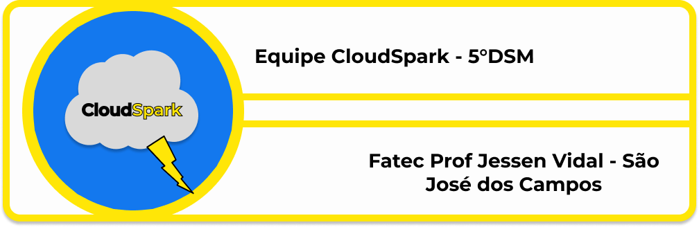
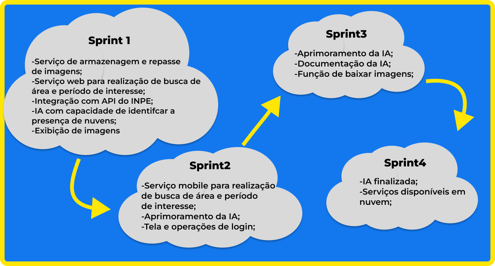

<h1 id="topo" align="center"> 🌩️ CloudSpark 🌩️</h1>

  

 

 
  <a href="#sobre">Sobre</a>  |  
  <a href="#entregas">Entregas</a>  |
  <a href="#backlog">Backlog</a> |
  <a href="#docs da ia">Documentação da IA</a>  |
  <a href="#repositorios"> Repositórios</a> |
  <a href="#tecnologias">Tecnologias</a>  |
  <a href="#equipe">Equipe</a> |

---

## 🗺️  Sobre o Projeto

As técnicas de sensoriamento remoto óptico orbital enfrentam dificuldades em suas capacidades de imageamento devido, principalmente, à cobertura de nuvens. Tendo isso em mente, nós estabelecemos como objetivo desse projeto criar uma aplicação que seja capaz de analisar imagens disponibilizadas pelo sensor WPM do CBERS4A, após uma determinada área de busca ser escolhida, de acordo com um período e uma amplitude de interesse e então, aplicar uma máscara gerada automaticamente por uma inteligência artificial, que apresentará os focos com coberturas de nuvens e sombras de nuvens, permitindo também, o download destas imagens. 

Esse sistema contará com disponibilidade para dispositivos móveis, bem como, uma interface web intuitiva para realização das buscas de interesse. Além disso, a aplicação será integrada com uma IA de autoria própria, amplamente treinada e testada.

→ [Voltar ao topo](#topo)

---

## 🔨 Entregas

| Sprint | Previsão | Status | Relatório da Sprint |
|:--:|:----------:|:------------:|:-------------:|
| 01 | 29/09/2024 | ✔️ Concluída | [Relatório](https://github.com/CloudSparkTeam/documentation/blob/main/sprints/sprint1.md) |
| 02 | 20/10/2024 | ✔️ Concluída | [Relatório](https://github.com/CloudSparkTeam/documentation/blob/main/sprints/sprint2.md) |
| 03 | 10/11/2024 | ✔️ Concluída | [Relatório](https://github.com/CloudSparkTeam/documentation/blob/main/sprints/sprint3.md) |
| 04 | 01/12/2024 | ✔️ Concluída | [Relatório](https://github.com/CloudSparkTeam/documentation/blob/main/sprints/sprint4.md) |

→ [Voltar ao topo](#topo)

---

## 📝 Backlog do Produto

  
|Sprint | Requisito | status |
|:-----:|:----------:|:-----:|
| 1 | Serviço backend responsável pelo repasse das imagens analisadas | ✔️ |
| 1 | Aplicação frontend web com mapas interativos e função de busca de área de interesse| ✔️ |
| 1 | Serviço de IA responsável por analisar e gerar máscaras de cobertura | ✔️ |
| 1 | As funções de buscas devem permitir um intervalo de tempo desejado| ✔️ |
| 1 | Implementação do serviço de IA em nuvem | ✔️ |
| 2 | Aplicação frontend mobile com mapas interativos e função de busca por zona de interesse| ✔️ |
| 2 | Tela e operações de login | ✔️ |
| 3 | Documentação do serviço de IA| ✔️ |
| 3 | Função de download de imagens analisadas | ✔️ |
| 4 | Visualização de camadas em detalhes | ✔️ |
| 4 | Implementação do serviço mobile em apk | ✔️ |
| 4 | Implementação do serviço web em nuvem | ✔️ |
| 4 | Implementação do serviço backend em nuvem | ✔️ |
| 4 | Implementação do serviço da IA em nuvem | ✔️ |

## 📝 Backlog das Sprints

  

 

---

### Para visualização das user stories do projeto:
→ [Ver Epics e UserStories](https://github.com/CloudSparkTeam/documentation/blob/main/docs/EpicsUserStories.md)

→ [Voltar ao topo](#topo)

---

## 🤖☁️ Documentação da IA

A documentação sobre utilização da IA está presente na descrição do seguinte repositório:

- → [Documentação IA](https://github.com/CloudSparkTeam)

[documetacao](https://github.com/CloudSparkTeam/documentation/blob/main/docs/DocumentacaoIA.md)

→ [Voltar ao topo](#topo)

---

## 📡 Repositórios

- → [Serviço Backend](https://github.com/CloudSparkTeam/cloudSpark-warehouse)
- → [Serviço Frontend Web](https://github.com/CloudSparkTeam/cloudSpark-web)
- → [Serviço Frontend Mobile](https://github.com/CloudSparkTeam/cloudSpark-mobile)
- → [Serviço de IA](https://github.com/CloudSparkTeam/cloudSpark-terminator)

→ [Voltar ao topo](#topo)

---

## 🛠️ Tecnologias utilizadas

| Ferramenta      | Tipo de Tecnologia       |
|:---------------:|:-----------------------:|
| **TypeScript**  | 🔨 Desenvolvimento      |
| **Python**      | 🔨 Desenvolvimento      |
| **YOLO e Roboflow** | 🔨 Desenvolvimento  |
| **Colab**       | 🔨 Desenvolvimento         |
| **React Native**| 🔨 Desenvolvimento      |
| **React**       | 🔨 Desenvolvimento      |
| **Docker**      | 🔧 Desenvolvimento      |
| **Git & GitHub**| 🔧 Controle de Versão   |
| **AWS**         | ☁️ Infraestrutura na Nuvem |
| **Prisma**      | 🔧 Banco de Dados       |
| **PostgreSQL**  | 🔧 Banco de Dados       |
| **Slack**       | 👥 Comunicação          |
| **Jira**        | 👥 Gestão de Projetos   |
| **Figma**       | 📝 Prototipação         |

→ [Voltar ao topo](#topo)

---

## 🧑‍💻 Colaboradores

|    Função     | Nome                                  |                                                                                                                                                      LinkedIn & GitHub                                                                                                                                                      |
| :-----------: | :------------------------------------ | :-------------------------------------------------------------------------------------------------------------------------------------------------------------------------------------------------------------------------------------------------------------------------------------------------------------------------: |
| Product Owner | Caio Vitor Dias |                |
| Scrum Master  | Igor Da Silva Pereira |               |
|   Dev Team    | Augusto Henrique Buin |       |
|   Dev Team    | Felipe Augusto Graciano |   |
|   Dev Team    | Gabriela da Silva Barbosa |   |
|   Dev Team    | Julio de Paula Machado |   |
|   Dev Team    | Valderi Douglas |   |
|   Dev Team    | Vitor Garcez de Oliveira |   |

→ [Voltar ao topo](#topo)
