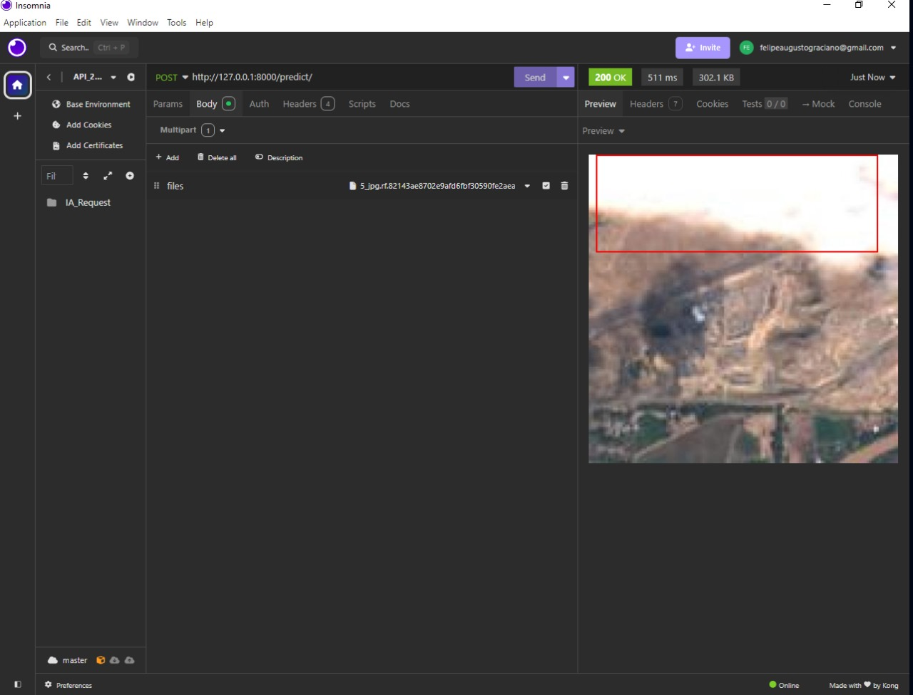
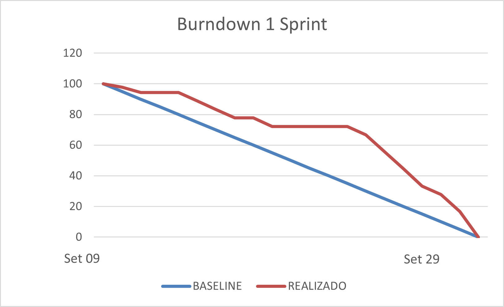

<h1 align="center"> Equipe CloudSpark - Sprint 1: 09/09/2024 à 29/09/2024 </h1>

 

    <a href="#objetivo">Objetivo da Sprint</a>  |  
    <a href="#entrega">Entregas</a>
    <a href="#backlog">📝 Backlog da Sprint</a>  |  
    <a href="#burndown">📉 Burndown</a>

---

<h2 id="objetivo">🎯 Objetivos da Sprint</h2>

O foco principal desta primeira sprint foi:

- **Criação de uma inteligência artificial** capaz de identificar a presença de nuvens nas imagens recolhidas, aplicando uma máscara ao encontrá-las. Este serviço foi disponibilizado em um servidor AWS.
- **Desenvolvimento de uma plataforma web** para interação com o mapa, permitindo buscas em regiões de interesse, cujas coordenadas são passadas para a IA.
- **Gestão e armazenamento** das imagens analisadas através de um serviço backend.

→ [Voltar ao topo](#topo)

<h2 id="entregas">📦 Entregas</h2>

### 🎥 Vídeo de Funcionamento do Projeto (Sprint 1)

Atualmente, o projeto está assim:

  

### 📸 Tratamento de Imagem Através da IA

  

---

<h2 id="backlog">📝 Backlog da Sprint</h2>
  

  
| Sprint | Requisito | Status |
|:------:|:----------:|:------:|
| 1      | Serviço backend responsável pelo repasse das imagens analisadas | ✔️ |
| 1      | Aplicação frontend web com mapas interativos e função de busca de área de interesse | ✔️ |
| 1      | Serviço de IA responsável por analisar e gerar máscaras de cobertura | ✔️ |
| 1      | Funções de busca devem permitir intervalo de tempo desejado | ✔️ |
| 1      | Implementação do serviço de IA na nuvem | ✔️ |

---

<h2 id="burndown">📉 Burndown</h2>

    Este é o burndown da equipe atualizado. Enfrentamos alguns contratempos, como na idealização inicial do projeto:

  

→ [Voltar ao topo](#topo)
