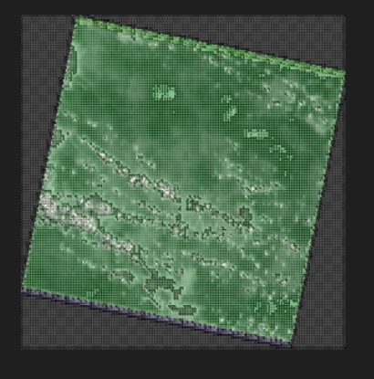
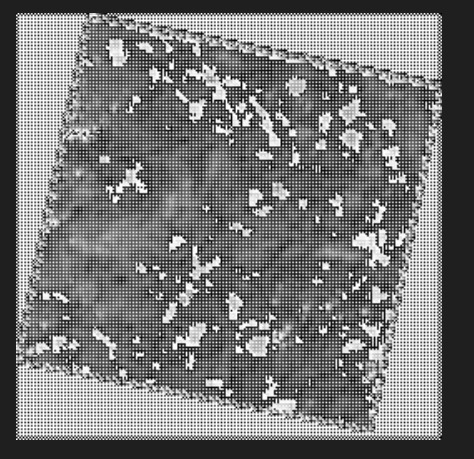
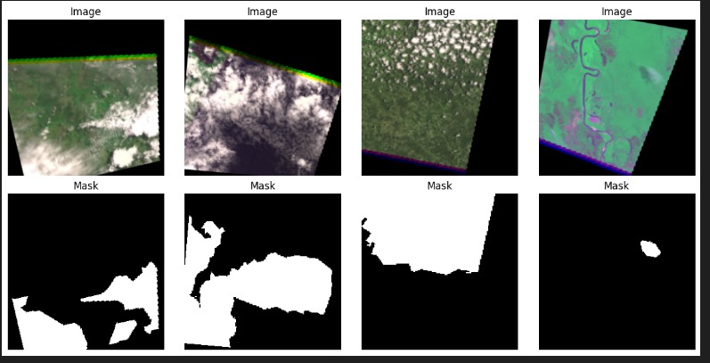
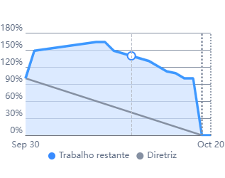

<h1 align="center"> Equipe CloudSpark - Sprint 2: 30/09/2024 à 20/10/2024 </h1>

 

    <a href="#objetivo">Objetivo da Sprint</a>  |  
    <a href="#entrega">Entregas</a>
    <a href="#backlog">📝 Backlog da Sprint</a>  |  
    <a href="#burndown">📉 Burndown</a>

---

<h2 id="objetivo">🎯 Objetivos da Sprint</h2>

O foco principal desta primeira sprint foi:

→ [Voltar ao topo](#topo)

<h2 id="entregas">📦 Entregas</h2>

### 🎥 Vídeo de Funcionamento do Projeto (Sprint 2)

<h3 align="center">PLATAFORMA MOBILE</h3>
<h4 align="center">O vídeo do projeto na plataforma mobile foi dividido em 3 partes, sendo elas consecutivamente:</h4>
<li>1 - Cadastro de usuário e Login</li>

  

<li>2 - Busca por região de interesse (através de busca de cidade)</li>

  

<li>3 - Busca por região de interesse (através de selecionar 4 pontos da área de interesse)</li> 

  

<h3 align="center">PLATAFORMA WEB</h3>

  

### 📸 Tratamento de Imagem Através da IA

  
  
  

---

<h2 id="backlog">📝 Backlog da Sprint</h2>
  

  
| Sprint | Requisito | Status |
|:------:|:----------:|:------:|
| 2      | Aplicação frontend mobile com mapas interativos e função de busca por zona de interesse| ✔️ |
| 2     | Tela de login web e mobile| ✔️ |
| 2      | Aprimoramento do serviço de IA na nuvem | ✔️ |

---

<h2 id="burndown">📉 Burndown</h2>

    Este é o burndown da equipe atualizado. Enfrentamos alguns contratempos, como termos de adicionar novas tasks depois de iniciarmos a 2 sprint:

  

→ [Voltar ao topo](#topo)
