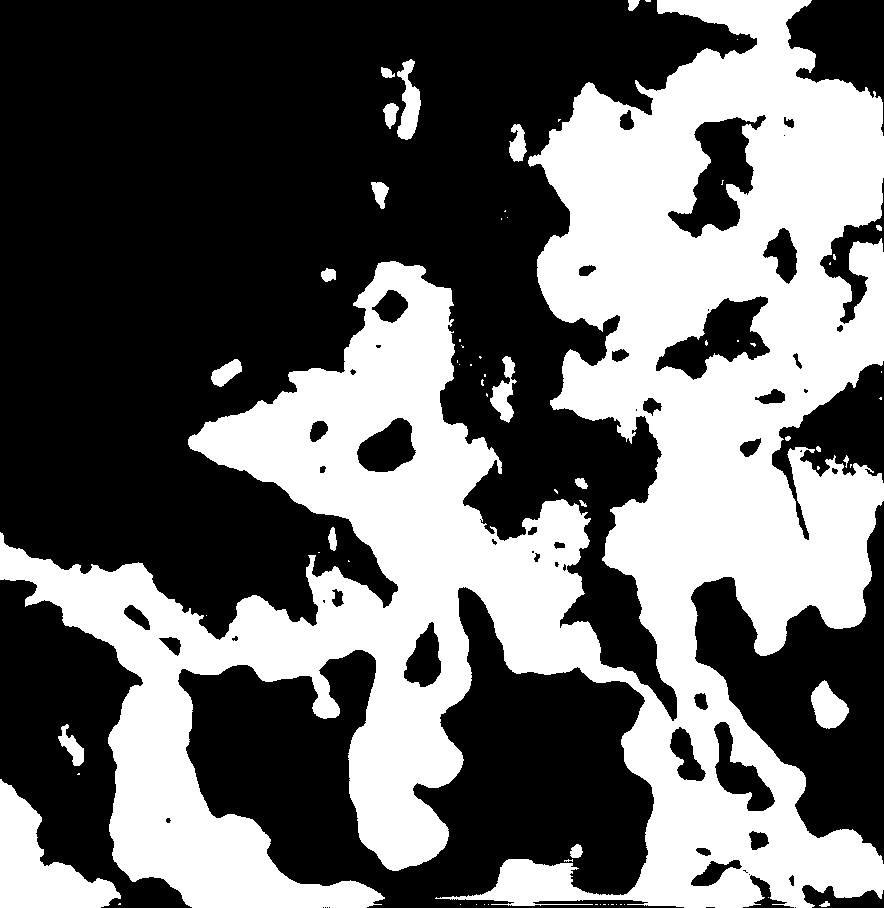
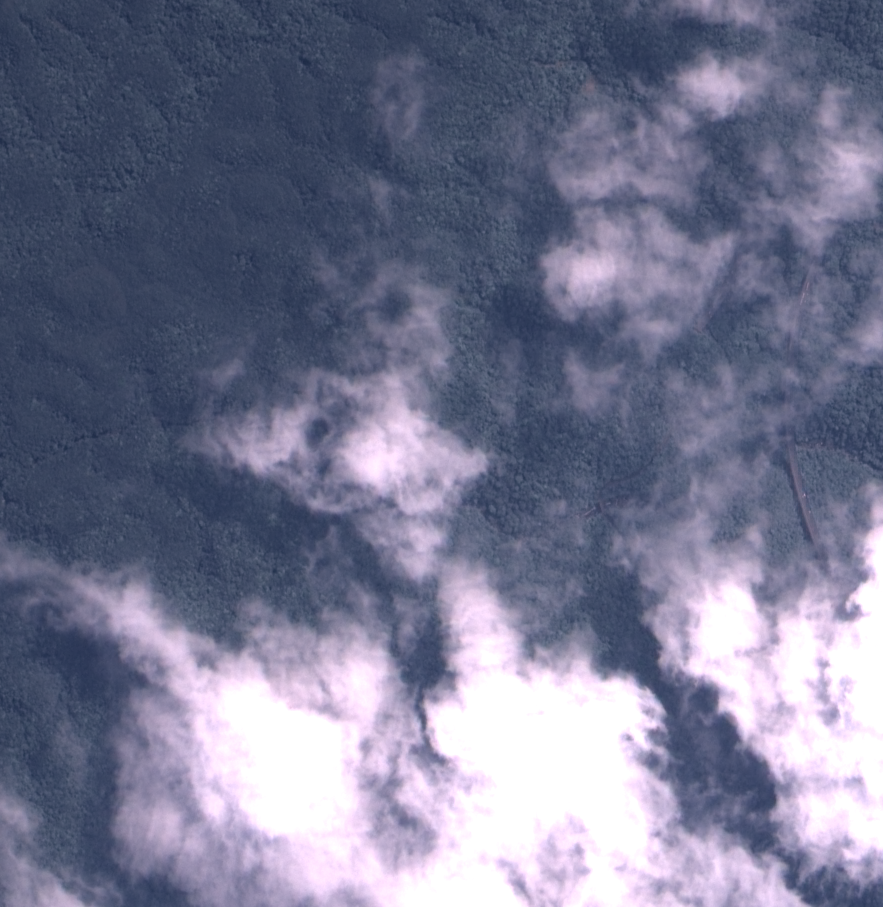
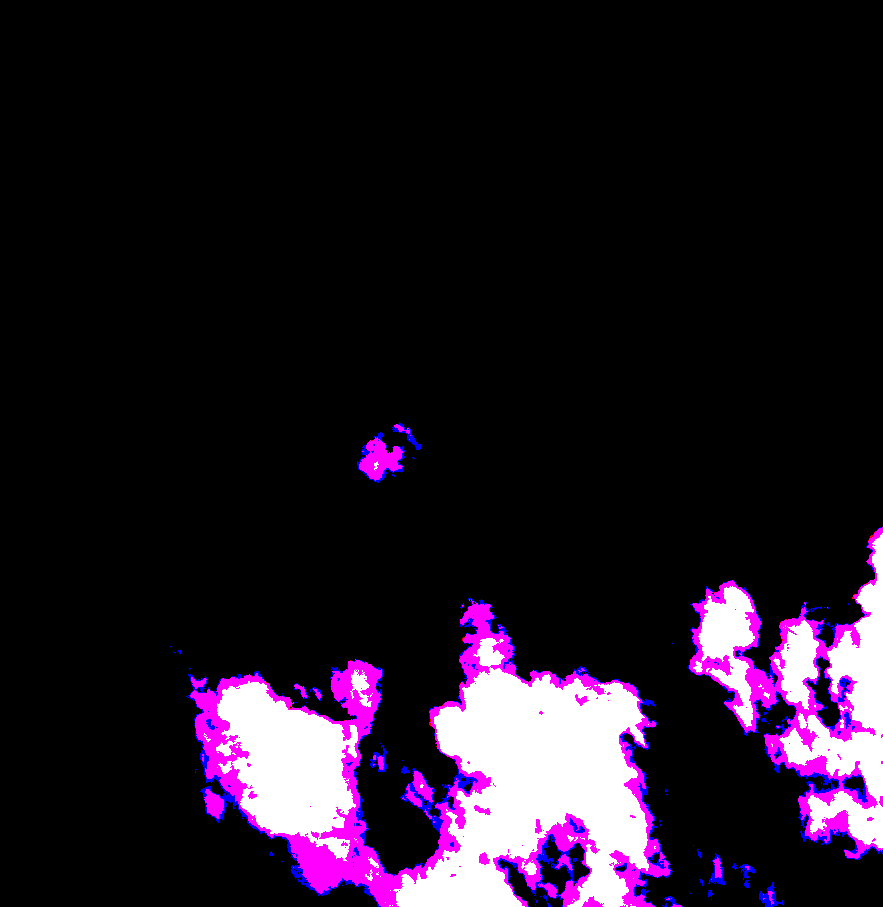
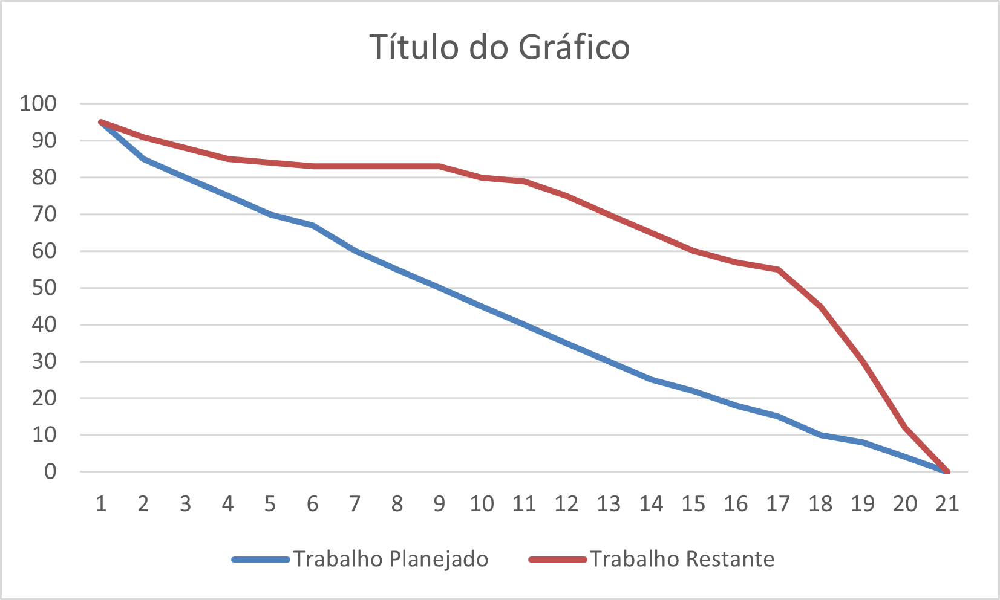

<h1 align="center"> Equipe CloudSpark - Sprint 4: 11/10/2024 à 01/12/2024 </h1>

 

    <a href="#objetivo">Objetivo da Sprint</a>  |  
    <a href="#entrega">Entregas</a>
    <a href="#backlog">📝 Backlog da Sprint</a>  |  
    <a href="#burndown">📉 Burndown</a>

---

<h2 id="objetivo">🎯 Objetivos da Sprint</h2>

O foco principal desta sprint foi desenvolver a ia para processar e tratar arquivos .tif e fazer as camads aparecerem na tela de detalhes:

→ [Voltar ao topo](#topo)

<h2 id="entregas">📦 Entregas</h2>

### 🎥 Vídeo de Funcionamento do Projeto (Sprint 4)
<h2> Temos todos os vídeos do funcionamento desde a sprint 1, caso queira verificar o desenvolvimento do projeto!</h2>

<h3 align="center">PLATAFORMA MOBILE</h3>
<h4 align="center">O vídeo do projeto na plataforma mobile:</h4>
<li>Tela de histórico e botão para baixar</li> 

  

<h3 align="center">PLATAFORMA WEB</h3>

  

### 📸 Tratamento de Imagem Através da IA

  
  
  

---

<h2 id="backlog">📝 Backlog da Sprint</h2>
  

  
| Sprint | Requisito | Status |
|:------:|:----------:|:------:|
| 4      | Opções de visualizar as camadas | ✔️ |
| 4      | Serviço mobile em apk | ✔️ |
| 4      | Serviço da IA na nuvem | ✔️ |
| 4      | Seviço backend na nuvem | ✔️ |
| 4      | Seviço web na nuvem | ✔️ |

---

<h2 id="burndown">📉 Burndown</h2>

    Este é o burndown da equipe atualizado. Enfrentamos alguns contratempos, como termos de adicionar novas tasks depois de iniciarmos a 4 sprint:

  

→ [Voltar ao topo](#topo)
